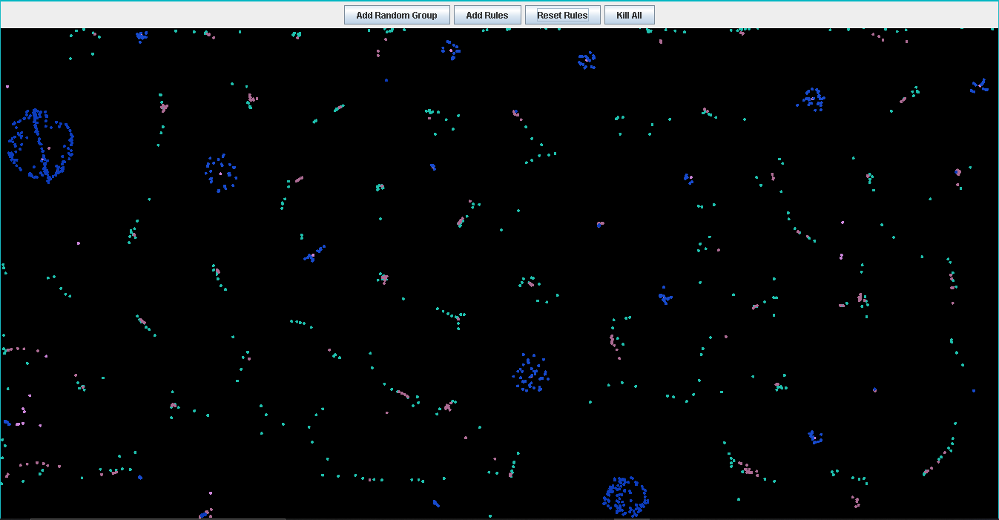

# simple_pixel_simulation or MiniWorld – Particle Interaction Simulator

MiniWorld is a simple GUI-based particle simulator using **Java Swing**. It allows users to create colored particle groups and define **interaction rules** between them. These rules simulate basic gravitational behavior—either **attraction** or **repulsion**—based on distance and a defined force parameter.

Particles are visualized as small circles (radius 4), giving the appearance of points moving around the canvas.

## 💡 Features

* Create random **particle groups** (colonies) of varying size and color.
* Define **interaction rules** between groups.
* Observe dynamic particle motion governed by defined rules.
* Simple GUI with buttons to:

  * Add group
  * Add rule
  * Reset rules
  * Clear everything

---

## 🖥️ How to Run

1. **Requirements**

   * Java JDK 22 (or ensure JDK version matches your compiler; error `Unsupported class file major version 68` means JDK 22 is required)
   * IDE or CLI tool that supports Java projects

2. **Compile & Run**
   If using command line:

   ```bash
   javac main/java/miniWorld/*.java
   java main.java.miniWorld.MyCanva
   ```

3. If using IntelliJ or Eclipse:

   * Import as a Java project.
   * Ensure `main.java.miniWorld.MyCanva` is set as the main class.
   * Run the project.

---

## 🧠 Rule Logic (Core Mechanics)

Rules define the **force interaction** between two groups of particles.

Each rule includes:

* Two groups: `group1`, `group2`
* A gravity value `g ∈ ]-1, 1[`:

  * Negative: attraction
  * Positive: repulsion
* A minimum and maximum distance range `[min_d, max_d]` within which the rule is active

### Interaction Algorithm

In each update (`Rules.applayAll()`):

1. For each particle in `group1`, the system:

   * Iterates over all particles in `group2`
   * Computes distance `d`
   * If `d` is within the `[min_d, max_d]`, applies force:

     $$
     F = \frac{gravity}{d}
     $$
   * Updates velocity with:

     $$
     v_x = (v_x + F_x) \times 0.5
     $$
   * Updates position with new velocity
2. If a particle hits the canvas border, it reflects by inverting its velocity.

This rule-based system creates visually compelling motion, enabling emergent behaviors like clustering or scattering based on rule configurations.

---

## 🧱 Project Structure Overview

```
miniWorld/
│
├── MyCanva.java       → Main GUI panel and application entry point
├── Rules.java         → Defines interaction logic between particle groups
├── Group.java         → Represents a collection of particles
├── Partical.java      → Defines individual particle with position & velocity
├── ParticleRenderer.java → Handles drawing the background and particles
├── Shap.java          → Enum or helper for shape types (e.g., circle)
```

---


